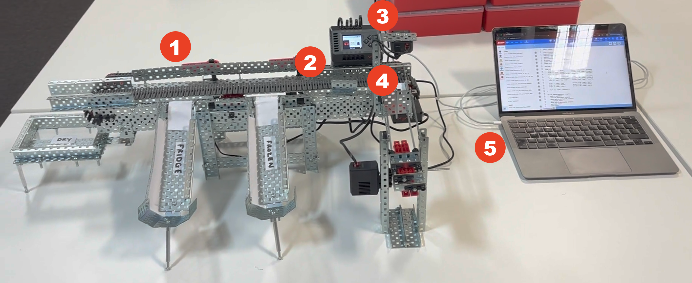
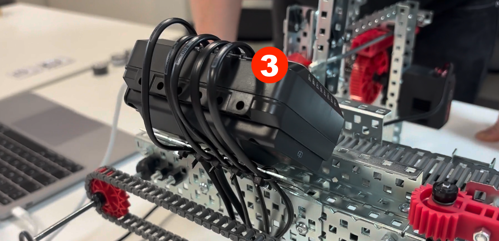

# Shopping-Distributor
Robotics 55-608216-AF-20245   
Assessment Two

Liam Hammond C1022456  
Guy Nicklin C1009267

## Task 
Use the VEX EXP kit to build a robot that will perform a repetitive, complex, task automatically and without the need for intervention or control from an operator.

## Solution
### Shopping Distributor
We have created an automated shopping distribution robot based upon an items storage temperature needs.
A user will scan an item - the robot will validate the item, push it onto a conveyor belt, direct the item to the correct storage area.

### Hardware Used
VEX kits used:
- [VEX EXP Education Kit (2x)](https://www.vexrobotics.com/exp-kits.html)
- [Tank Tread Kit](https://www.vexrobotics.com/276-6558.html)
- [AI Vision Sensor](https://www.vexrobotics.com/276-8659.html)

#### EXP Robot Brain
Central connection point to run codebase, connect to hardware and display text.
- Smart Cable (5x)

#### Drive Chain
Move an item down the conveyor belt.\
_Chain Link_
- V5 Smart Motor (5.5W)
- Chain Links
- 8” Shaft (2x)
- 16T Sprocket, 6P (2x)

_Conveyor Belt_
- Tank Treads
- Tank tread drive/idler wheels (3x)
- 5” Shaft (1x)

#### Pusher
Moves an item onto the conveyor belt.
- V5 Smart Motor (5.5W)
- 5” Shaft (1x)
- 8” Shaft (2x)
- 60T High Strength Gear (1x)
- Rack Gear (4x)

#### Paddle 1
Direct items into the freezer storage section.
- V5 Smart Motor (5.5W)
- 5” Shaft (1x)
- 1x5 Crank Arm with 23T Gear (1x)
- 2x12 Flat Beam (1x)

#### Paddle 2
Direct items into the fridge storage section.
- V5 Smart Motor (5.5W)
- 5” Shaft (1x)
- 1x5 Crank Arm with 23T Gear (1x)
- 2x12 Flat Beam (1x)

#### AI Vision Sensor
Scans AI Vision Sensor [AprilTags](https://content.vexrobotics.com/docs/AprilTags_Printable_Letter_REV2.pdf).

#### 3D Printed Pucks (9x)
Representations of food items, with an april tag stuck on top.
- 3cm width
- 1.5cm height

### Control Systems
#### Item Scanning and Identification 
The integration of the AI Vision Sensor is a crucial control system. Its purpose is to automatically identify the scanned item by reading the AprilTag. This information is then used to determine the item's properties, such as its storage temperature. This control system eliminates the need for manual input and forms the foundation of the automated sorting process. The complexity lies in the sensor's ability to accurately detect and decode the tags under varying conditions.

#### Conveyor Belt Control
The motor driving the conveyor belt represents another essential control system. Its function is to move the identified items from the initial scanning platform towards the sorting mechanism. The control here involves starting and potentially stopping the belt at appropriate times. The justification is clear: without a controlled method of transporting items, the robot could not distribute them.

#### Item Pushing Mechanism
The pusher motor and its associated mechanism form a control system designed to transfer an item from the scanning area onto the moving conveyor belt. This controlled push ensures the item is correctly positioned for transportation and subsequent sorting. The justification is to automate the loading of items onto the belt, preventing manual intervention. The control involves precise movement of the pusher arm.

#### Temperature-Based Sorting Paddles
The two paddle motors (Paddle 1 and Paddle 2) are at the heart of the sorting control system. Based on the temperature requirement of the scanned item ("fridge" or "frozen"), the program activates the corresponding paddle to divert the item to the correct storage area. The justification for this system is to automate the crucial task of separating items according to their storage needs. The complexity involves the decision-making process based on the item's temperature and the timed activation of the appropriate paddle.

#### Checkout Detection
The system's ability to recognize the "Checkout" tag (ID 29) and initiate the final steps (stopping the belt, displaying the total) is a specific control system for concluding the shopping process. Its inclusion is justified by the need to signal the end of the item distribution and provide feedback to the user.

### Error Handling
#### Invalid Item Detection
If a barcode is scanned and is not found in the items array (representing the store), the error handling routine takes action by informing the user about the problem via the screen, providing an auditory cue (power down sound),instructing the user on the necessary step (remove the item), and pausing the process briefly.

#### Item Falling From Conveyor
Protective barriers have been placed surrounding the conveyor belt to ensure the item travelling down reaches its destination. At the first left of the belt, a 1x2x1x4 Channel was placed at a slight diagonal to re-align a puck that may not have fallen onto the belt in the centre.

#### Incorrect Item Placement And Timing
The system, using its threading to manage multiple motors at once, will only process one item at a time. And the pushing mechanism will only activate once per validated item scan cycle. This prevents multiple pucks from being on the conveyor belt at once if placed on the scanning block quickly after the other.
In addition to this, the size design of the scanning platform is planned to be as small as possible to help prevent multiple pucks being loaded on at once.

#### Paddle Rotation Location
Due to the inherent slight give in the paddles, even when turned to specific angles, pucks could sometimes pass and not enter the correct storage area. Additionally, the paddle's return to the exact same spot wasn't always consistent, potentially creating an offset over time. To rectify these errors, we implemented a slight overturn in the motor's codebase to ensure firm contact, and we added physical stoppers (screws and storage area side barriers) to ensure consistent paddle positioning.

## Edge Cases

### 1 - No item is presented to the AI Vision sensor.
__Expected Behavior__: The `ai_cam()` function should return `None`, and the main loop should continue to wait for a valid scan without errors.\
__Actual Behavior__: The `ai_cam()` function takes a snapshot and if `len(ai_objects)` is 0, it returns `None`. The main loop proceeds, `scan_id` remains `None`, and the robot does nothing until an item is presented.\
__Handling__: Implicitly handled by the `while True` loop, which continues to call `ai_cam()` until a valid ID is returned.

### 2 - An item with an unrecognized ID (not in the `items` list) is scanned.
__Expected Behavior__: The `get_item_from_id()` function should return `None`. The main loop should enter the `else` block, print "Unrecognised item" to the screen, play the power down sound, and wait for 2 seconds.\
__Actual Behavior__: This matches the expected behavior as implemented in the `else` block after the `if matched_item:` condition.\
__Handling__: Explicitly handled by the code that checks if `matched_item` is `None`.

### 3 - The "Checkout" tag (ID 29) is scanned before any other items.
__Expected Behavior__: The `if scan_id is 29:` condition should be met. The robot should play the tada sound, stop the belt, call `print_shop()` (which will print a total of 0), wait for 5 seconds, and then break out of the `while` loop, ending the program.\
__Actual Behavior__: This matches the expected behavior based on the code.\
__Handling__: Explicitly handled by the `if scan_id is 29:` block.

### 4 - An item is scanned, and its `temp` property in the `items` list is neither "fridge" nor "frozen".
__Expected Behavior__: The code should enter the `else` block after the `elif matched_item["temp"] == "frozen":` condition, and it will `wait(3000, MSEC)`. This assumes that any temperature not "fridge" or "frozen" should go to the dry store.\
__Actual Behavior__: The robot will wait for 3 seconds without activating any paddle, effectively sending the item towards the dry store area.\
__Handling__: Implicitly handled by the final `else` condition in the temperature sorting logic.

### 5 - The AI Vision sensor malfunctions or is disconnected during operation.
__Expected Behavior__: The `ai_vision.take_snapshot()` function might raise an exception or return an unexpected value. The program should ideally handle this gracefully, perhaps by displaying an error message on the brain's screen and stopping the main loop.\
__Actual Behavior__: The current code doesn't have explicit error handling for potential issues with the `ai_vision.take_snapshot()` function. An exception might crash the program.\
__Handling__: Not currently handled. Error handling (e.g., using `try-except` blocks) could be added around the `ai_vision.take_snapshot()` call to make the system more robust.

## How To Build And Use
### Prerequisites
- The built VEX EXP robot. (1)
- The EXP Robot Brain, with a charched battery attatched and placed on the mount at the start of the conveyor belt. (2)
- All five Smart Cables, plugged into the top five ports of the EXP Robot Brain, in order of port mapping. (3)
- The AI Vision Camera plugged into a power supply. (4)
- A laptop connected to the EXP Robot Brain via a USB-C cable. (5)

### Downloading The Codebase
There are two paths to opening the EXP Python code, before applying it to the EXP Robot Brain.

#### A) Copy Code
1. Open the [VEX EXP IDE](https://codeexp.vex.com/).
2. Click on 'File' > 'New Text Project' > 'Python' > 'EXP Brain'.
3. Clear the current template code.
4. Copy all code from [main.py](main.py) in this Git Repository.
5. Paste code in the IDE.

#### B) Open File
1. Download the [Robotics_ShoppingDistributor.exppython](Robotics_ShoppingDistributor.exppython) file in this Git Repository.
2. Open the [VEX EXP IDE](https://codeexp.vex.com/).
3. Click on 'File' > 'Open'.
4. Select the 'Robotics_ShoppingDistributor.exppython' file from your computer. Press 'open'.

Now the code base is in the IDE, we can download it onto the EXP Robot Brain:

1. Click on 'BRAIN' button, and press 'Connect' 
2. Select the serial port connected to the EXP Robot Brain. 
3. Click on the 'DOWNLOAD' button.

### Running The Shopping Distributor
The codebase should now be installed on the EXP Robot Brain, and all motors, and the camera, should be powered. To begin using the robot, press the 'RUN' button in the VEX EXP IDE, or hover over 'Run' option on the EXP Robot Brain, and press the 'tick' button.

The conveyor belt should now be moving, and the robot is waiting for the first puck to be placed on the scanning platform.

For further clarification and a visual representation of the setup process (excluding file download), please see the demonstration below.

## Demonstration
A video to showcase the robot functioning.

## Resources Used
- [VEX EXP documentation for pyhton](https://api.vex.com/exp/home/python/index.html)
- [Vision AI pyhton documentation](https://api.vex.com/exp/home/python/Vision/index.html)